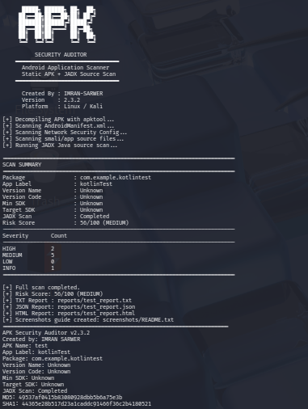
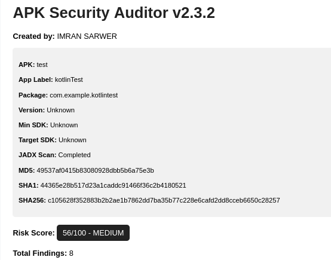
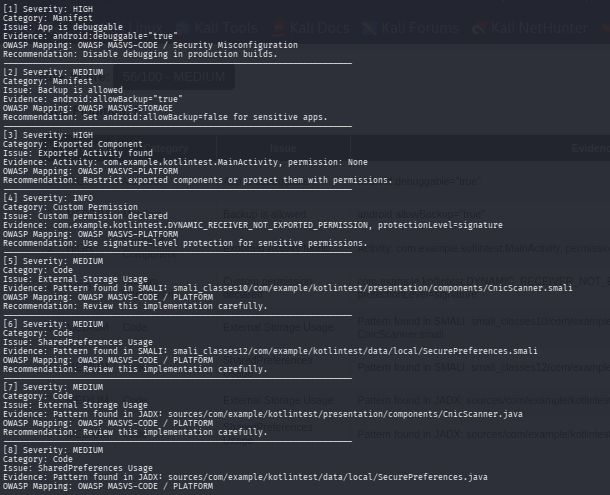
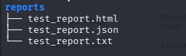

# APK Security Auditor


A professional Android APK Static Analysis Tool developed by **IMRAN SARWER** for Android Application Security Assessment, Secure Code Review, and Mobile Security Research.

---

# Overview

APK Security Auditor is a Python-based Android Security Analysis Tool designed to perform static security assessments on Android APK files.

The tool leverages:

- APKTool
- JADX
- Python Automation
- OWASP MASVS Security Checks

to identify common Android application security weaknesses including:

- Debuggable Applications
- Exported Components
- Insecure Storage Usage
- Weak Cryptography
- Hardcoded Secrets
- Firebase Endpoints
- Dangerous Permissions
- Network Security Issues

The tool automatically generates professional TXT, JSON, and HTML reports with risk scoring and security findings.

---

# Tool Demonstration

## Terminal Execution



The tool automatically performs:

- APK Decompilation
- AndroidManifest Analysis
- Smali Source Analysis
- JADX Java Source Analysis
- Risk Scoring
- Security Report Generation

---

# Screenshots

## HTML Security Report



---

## Security Findings



---

## Generated Reports



---

# Features

## Android Manifest Analysis

### Security Configuration Checks

- Debuggable Application Detection
- Backup Enabled Detection
- Cleartext Traffic Detection
- Network Security Configuration Analysis

### Component Analysis

- Exported Activities Detection
- Exported Services Detection
- Exported Receivers Detection
- Exported Providers Detection
- Deep Link Discovery

### Permission Analysis

- Dangerous Permissions Detection
- Custom Permission Analysis

---

## Source Code Analysis

### Smali Analysis

The tool scans decompiled Smali files for:

- Hardcoded Secrets
- API Keys
- JWT Tokens
- Firebase Endpoints
- Runtime Command Execution
- SharedPreferences Usage
- External Storage Usage
- WebView Security Issues
- Weak Cryptography Patterns

---

### JADX Java Source Analysis

The tool automatically decompiles APK files using JADX and scans Java source code for:

- Security Misconfigurations
- Dangerous API Usage
- Storage Security Issues
- Network Security Issues
- Sensitive Information Exposure

---

# Reporting Features

The tool automatically generates:

### TXT Report

Human-readable security report.

### JSON Report

Machine-readable report for automation and integration.

### HTML Report

Professional browser-based report.

### APK Hashing

The tool calculates:

- MD5
- SHA1
- SHA256

for APK integrity verification.

### Risk Scoring

Automatic application risk calculation based on detected findings.

### OWASP MASVS Mapping

Security findings are mapped to relevant OWASP MASVS categories.

---

# Installation

## Requirements

- Python 3
- APKTool
- JADX
- Java Runtime Environment (JRE)

---

## Install Dependencies

```bash
sudo apt update

sudo apt install -y \
python3 \
python3-pip \
apktool \
jadx \
default-jre
```

---

## Verify Installation

```bash
python3 --version
apktool --version
jadx --version
java -version
```

Expected Output:

```text
Python 3.x
APKTool 2.x
JADX 1.x
OpenJDK 17+
```

---

# Usage

## Analyze an APK

```bash
python3 apk_auditor.py app.apk
```

Example:

```bash
python3 apk_auditor.py samples/test.apk
```

---

# Sample Output

```text
========================================================================
SCAN SUMMARY
========================================================================

Package      : com.example.app
Risk Score   : 56/100 (MEDIUM)

HIGH         : 2
MEDIUM       : 5
LOW          : 0
INFO         : 1
========================================================================
```

---

# Generated Reports

After execution:

```text
reports/
├── app_report.txt
├── app_report.json
└── app_report.html
```

---

# Example Security Findings

The tool can identify:

### Manifest Issues

- App is Debuggable
- Backup Enabled
- Exported Components
- Dangerous Permissions

### Storage Issues

- SharedPreferences Usage
- External Storage Usage

### Network Issues

- Insecure HTTP URLs
- Firebase Endpoints
- Cleartext Traffic

### Code Issues

- Runtime Command Execution
- WebView Security Risks
- Hardcoded Secrets
- Weak Cryptography

---

# Project Structure

```text
APK-Security-Auditor/
│
├── apk_auditor.py
├── README.md
├── .gitignore
│
├── findings.png
├── html-reports.png
├── reports.png
├── terminal.png
│
├── output/
├── reports/
└── screenshots/
```

---

# Current Capabilities

| Feature | Status |
|----------|----------|
| APKTool Integration | ✅ |
| JADX Integration | ✅ |
| Manifest Analysis | ✅ |
| Smali Analysis | ✅ |
| Java Source Analysis | ✅ |
| Risk Scoring | ✅ |
| HTML Reports | ✅ |
| JSON Reports | ✅ |
| TXT Reports | ✅ |
| APK Hashing | ✅ |
| OWASP MASVS Mapping | ✅ |

---

# Roadmap

## Version 3.0

Planned Features:

- VirusTotal API Integration
- MobSF Integration
- APK Certificate Analysis
- APK Signing Verification
- SSL Pinning Detection
- Firebase Security Misconfiguration Checks
- Root Detection Analysis
- Frida Detection
- Emulator Detection
- PDF Report Generation
- CVSS Scoring
- MITRE ATT&CK Mapping

---

# Technology Stack

- Python
- APKTool
- JADX
- Android Security
- Static Code Analysis
- OWASP MASVS

---

# Author

## IMRAN SARWER

Cyber Security Student  
Android Security Researcher  
Mobile Application Security Enthusiast

GitHub:

https://github.com/jamaliimran07

---

# Educational Purpose

This project was developed to strengthen practical knowledge in:

- Android Security
- Mobile Application Assessment
- Static Analysis
- Secure Code Review
- Security Automation

---

# Disclaimer

This tool is intended strictly for:

- Educational Purposes
- Security Research
- Authorized Security Assessments

Always obtain proper authorization before testing or analyzing third-party applications.

The author assumes no responsibility for misuse of this tool.

---

## ⭐ Support

If you find this project useful, consider giving it a star on GitHub.
